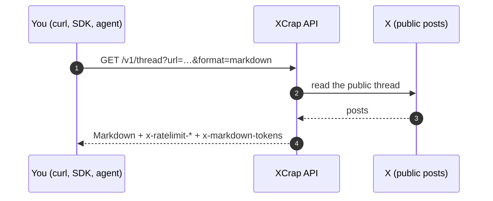
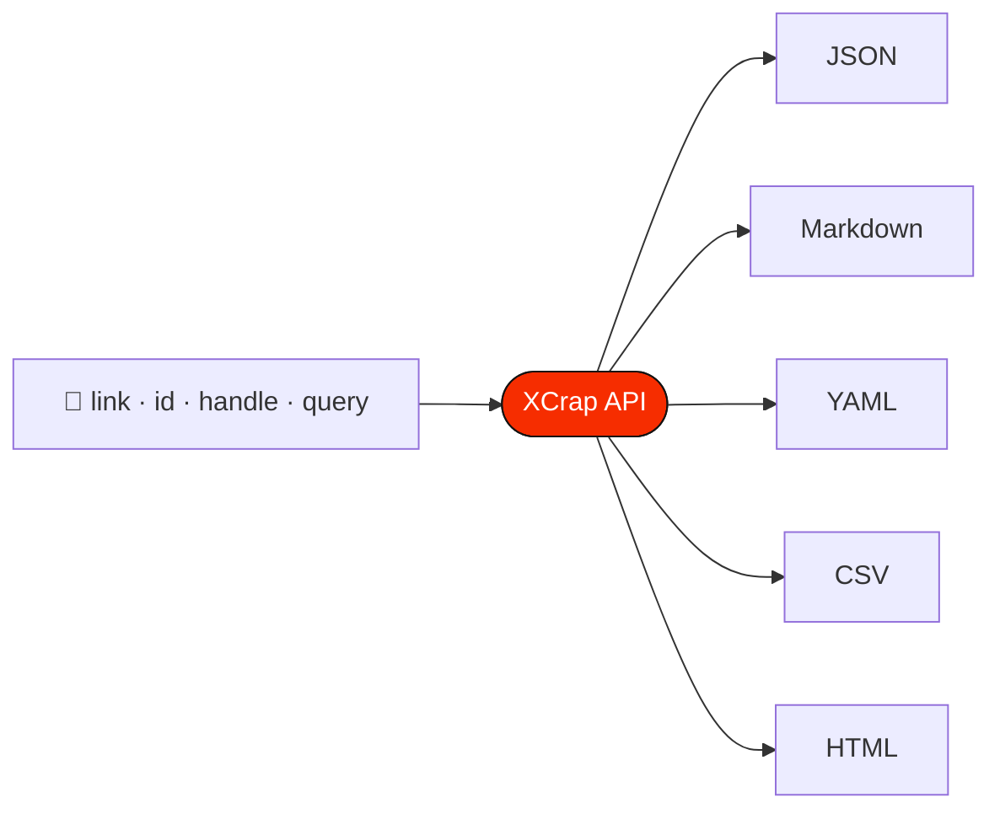

<p align="center">
  <a href="https://xcrap.cc/docs"></a>
</p>

<p align="center">
  <a href="https://xcrap.cc/docs"></a>
  <a href="openapi/openapi.json"></a>
  
  
  <a href="https://github.com/XcrapCC/xcrap-docs"></a>
</p>

<p align="center">
  <b>XCrap turns public X (Twitter) posts, threads, profiles and searches into Markdown, JSON, YAML, CSV or HTML.</b><br>
  <sub>No account · no API key · nothing to pay</sub>
</p>

<p align="center">
  <a href="guides/how-to-use.md">Guides</a> ·
  <a href="reference/api.md">API reference</a> ·
  <a href="sdk/node.md">Node SDK</a> ·
  <a href="sdk/python.md">Python SDK</a> ·
  <a href="agents/">For AI agents</a> ·
  <a href="https://xcrap.cc/docs">Live docs</a>
</p>

---

> [!NOTE]
> This repository is generated from the live site's own pages, OpenAPI spec and agent files, so it never says something [xcrap.cc](https://xcrap.cc) does not. The SDKs and the MCP server are updated with every API change too.

## Contents

- [Start here](#start-here)
- [How it works](#how-it-works)
- [Try it in ten seconds](#try-it-in-ten-seconds)
- [Endpoints](#endpoints)
- [Rate limits](#rate-limits)
- [Errors](#errors)
- [Official clients](#official-clients)
- [Related repositories](#related-repositories)

## Start here

| | Document | What it covers |
| --- | --- | --- |
| 🧭 | [Guides: how to use XCrap](guides/how-to-use.md) | The website, curl, MCP, the skill file, the SDKs, chat links |
| ❓ | [FAQ](guides/faq.md) | Pricing, limits, privacy, what it can read |
| 📘 | [API reference](reference/api.md) | Every endpoint, parameter, format and error |
| 🟩 | [Node SDK](sdk/node.md) | `npm install @xcrapcc/sdk` |
| 🐍 | [Python SDK](sdk/python.md) | `pip install xcrap-sdk` |
| 🤖 | [For AI agents](agents/) | [`llms.txt`](agents/llms.txt) and [`skills.md`](agents/skills.md), written for models |
| 🧾 | [OpenAPI 3.1](openapi/openapi.json) | [`openapi.json`](openapi/openapi.json) · [`openapi.yaml`](openapi/openapi.yaml) |

## How it works





## Try it in ten seconds

```bash
curl 'https://xcrap.cc/v1/tweet?url=https://x.com/jack/status/20&format=markdown'
```

> [!TIP]
> Every endpoint takes `?format=json|markdown|yaml|csv|html`, or reads your `Accept` header. Markdown responses carry `x-markdown-tokens`, so an agent can budget its context before it reads.

## Endpoints

| Endpoint | What it returns |
| --- | --- |
| `GET /v1/tweet` | One post, fully resolved |
| `GET /v1/thread` | A whole thread, unrolled in order |
| `GET /v1/replies` | The replies under a post |
| `GET /v1/search` | Search posts |
| `GET /v1/user` | A profile |
| `GET /v1/user/tweets` | An account's posts |
| `GET /v1/user/followers` | Who follows an account |
| `GET /v1/user/following` | Who an account follows |
| `GET /v1/user/history` | An account's posts, in bulk |
| `GET /v1/trends` | What is trending |
| `GET /v1/media` | List a post's media |
| `GET /v1/media/download` | Download one file |
| `POST /v1/bulk` | Up to fifty posts at once |

## Rate limits

Per IP and per endpoint. Every response carries `x-ratelimit-limit`, `x-ratelimit-remaining` and `x-ratelimit-reset`.

| Budget | Limit |
| --- | --- |
| tweet | 45 per 1 min |
| user | 45 per 1 min |
| thread | 15 per 1 min |
| timeline | 15 per 1 min |
| graph | 15 per 1 min |
| replies | 15 per 1 min |
| history | 4 per 5 min |
| search | 10 per 15 min |
| bulk | 6 per 5 min |
| media | 20 per 1 min |
| meta | 90 per 1 min |

> [!IMPORTANT]
> **Need more?** The [Enterprise plan](https://xcrap.cc/enterprise) offers higher rate limits, dedicated capacity, custom endpoints and formats, priority support, and invoices or agreements — with the same rules (public accounts only). Write to **[hello@xcrap.cc](mailto:hello@xcrap.cc)**.

## Errors

Every error body carries a code and a hint that says what to do next.

<details>
<summary><b>All 8 error codes</b></summary>

| Status | Code | Meaning |
| --- | --- | --- |
| 400 | `bad_request` | A parameter is missing or malformed. Check it against this page. |
| 404 | `not_found` | The post or account is deleted, suspended, private, or never existed. For a post, reason says which when X tells us: post_deleted, author_protected, author_suspended, withheld, removed_by_x, age_restricted, or unavailable. |
| 429 | `rate_limited` | Endpoint budget exhausted. Wait for the period in retry-after, or see the enterprise plan for higher limits. |
| 451 | `opted_out` | That account asked to be excluded from XCrap. |
| 500 | `internal_error` | Our fault. Already reported. Try again shortly. |
| 502 | `upstream_failed` | Every source refused. Usually brief; retry in a minute. |
| 504 | `upstream_timeout` | A source did not answer in time. Retry in a minute. |
| 503 | `search_unavailable` | Search capacity is used up for now, or search is not set up. Wait for retry-after. |

</details>

## Official clients

<table>
<tr>
<td width="33%" valign="top">

**🟩 Node.js**

```bash
npm install @xcrapcc/sdk
```

[Guide](sdk/node.md) · [Source](https://github.com/XcrapCC/xcrap-node)

</td>
<td width="33%" valign="top">

**🐍 Python**

```bash
pip install xcrap-sdk
```

[Guide](sdk/python.md) · [Source](https://github.com/XcrapCC/xcrap-python)

</td>
<td width="33%" valign="top">

**🤖 MCP**

Hosted, nothing to install:

```
https://xcrap.cc/mcp
```

Or locally: `npx -y @xcrapcc/mcp`

[Source](https://github.com/XcrapCC/Xcrap-mcp)

</td>
</tr>
</table>

## Related repositories

| Repository | What it is |
| --- | --- |
| 🟩 [**xcrap-node**](https://github.com/XcrapCC/xcrap-node) | Node.js SDK — `npm install @xcrapcc/sdk` |
| 🐍 [**xcrap-python**](https://github.com/XcrapCC/xcrap-python) | Python SDK — `pip install xcrap-sdk` |
| 🤖 [**Xcrap-mcp**](https://github.com/XcrapCC/Xcrap-mcp) | MCP server — hosted at `https://xcrap.cc/mcp`, or `npx -y @xcrapcc/mcp` |
| 🏠 [**XcrapCC**](https://github.com/XcrapCC) | Everything XCrap on GitHub |

Found a mistake in the docs? Open an issue.

---

<p align="center">
  <a href="https://xcrap.cc"><b>xcrap.cc</b></a> · <a href="https://xcrap.cc/docs">Docs</a> · <a href="https://xcrap.cc/openapi.json">OpenAPI</a> · <a href="https://xcrap.cc/llms.txt">llms.txt</a> · <a href="https://xcrap.cc/skills.md">skills.md</a><br>
  <sub>Public data only · Not affiliated with X Corp.</sub>
</p>
